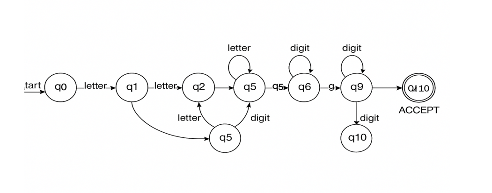
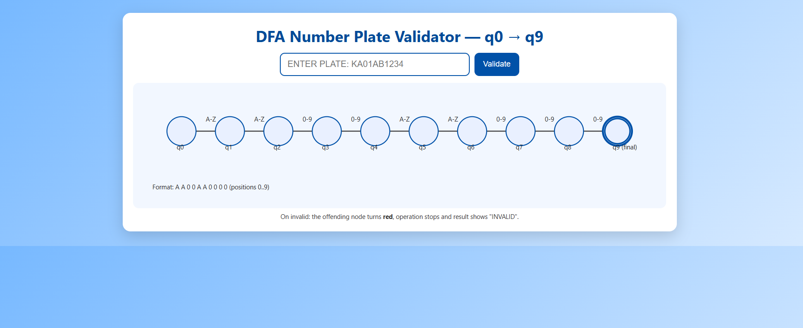
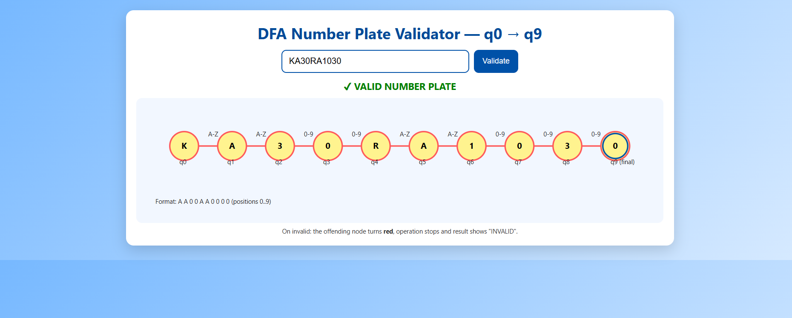
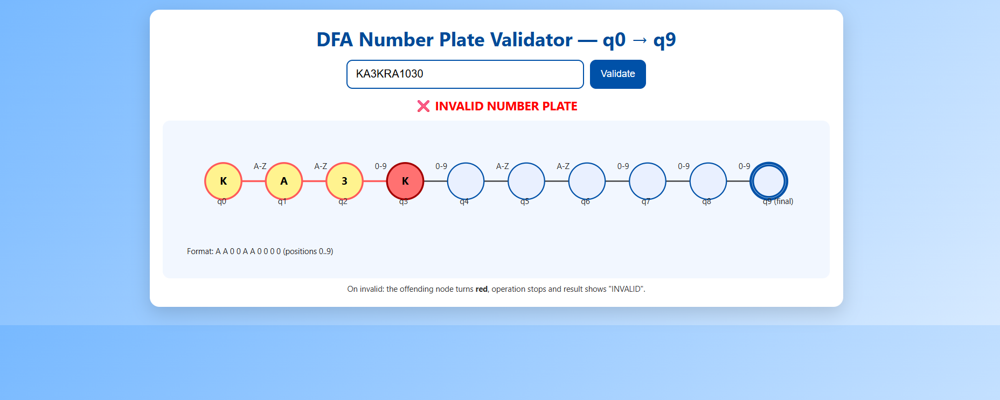

# 🚗 DFA Number Plate Validator Using Regular Expression  
## TOC Project 

This project is a **web-based Number Plate Validator** that uses **Regular Expressions (Regex)** and **DFA (Deterministic Finite Automaton)** principles to validate Indian vehicle number plates.

The project is created using **HTML, CSS, and JavaScript** and includes visual DFA diagrams.

---

## 📌 Project Overview

The system validates vehicle number plates by:

* Using a **Regex formula** to check the pattern
* Simulating **DFA state transitions**
* Displaying **valid or invalid results**
* Showing **state diagram images**
* Explaining the **formula and DFA logic**

---

## ✅ Features

* Real-time validation
* Uses Theory of Computation (TOC) concept
* DFA transition explanation
* Image-based DFA diagrams
* Table layout with two images per row
* Clean UI using CSS

---

## 🧾 Number Plate Format

The valid number plate format is:

AA00AA0000

Where:

* A → uppercase alphabet (A–Z)
* 0 → digit (0–9)

### ✅ Valid Example

KA01AB1234

### ❌ Invalid Example

KA3KRA1030

---

## 🧮 Regular Expression Used

The following Regular Expression is used for validation:

```
^[A-Z]{2}[0-9]{2}[A-Z]{2}[0-9]{4}$
```

---

## 🧠 DFA (Deterministic Finite Automaton) Logic

Each character in the plate moves through DFA states:

+------------+---------------------+
|   State    |   Expected Input    |
+------------+---------------------+
| q0 → q1     | Uppercase Letter   |
| q1 → q2     | Uppercase Letter   |
| q2 → q3     | Digit              |
| q3 → q4     | Digit              |
| q4 → q5     | Uppercase Letter   |
| q5 → q6     | Uppercase Letter   |
| q6 → q7     | Digit              |
| q7 → q8     | Digit              |
| q8 → q9     | Digit              |
| q9 → Final  | Digit              |
+-------------+--------------------+


If any input does not match the expected value, the DFA enters a **dead state** and marks the plate as **INVALID**.

---

## 🖼️DFA State Diagram

| DFA State Diagram |
|---------------------|
|  |

## 🧩 UI Description

The UI contains:

* A text input box for the vehicle number
* A "Validate" button
* Output message (VALID / INVALID)
* DFA explanation section
* Regex formula section
* Image table showing DFA diagrams

---

## ▶️ How to Run the Project

1. Download or copy the project files.
2. Make sure images are inside the `imgg` folder.
3. Open `index.html` in any web browser.
4. Enter a number plate and click **Validate**.

---

## 📚 Academic Use

This project is useful for:

* Theory of Computation (TOC)
* Automata Theory
* Compiler Design
* DFA and Regular Expression understanding

---

## 🖼️ DFA Diagram Images Table

| Initial DFA Diagram |
|---------------------|
|  |

| Invalid DFA | Valid DFA |
|------------|-----------|
|  |  |


